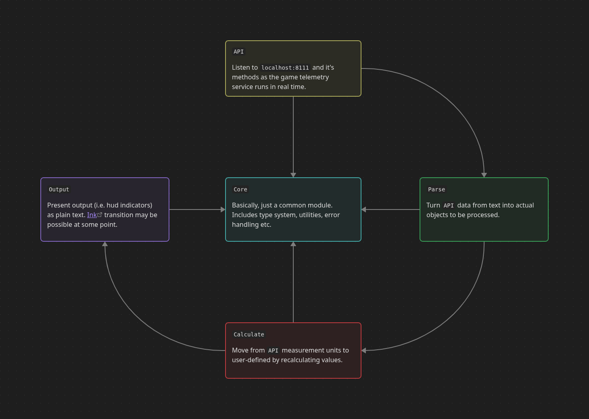

# T-HUD

_This is a provisional note, composed mostly for me._

A "terminal" (tui) hud for some online game.

## About this

So there is an app [MeSoftHorny/WTRTI](https://github.com/MeSoftHorny/WTRTI) which I got used to a while ago. Recently I have switched to a system which this app either does not support or makes it hard to be put together.

Therefore I've decided to fill that gap with a 'device' of mine, using a text-based environment, which will probably work for me.

## Specs

Some technical context for this app.

   

 

### Structure

The code style is supposed to be a result of "moderate, procedural-leaning" approach.

A basic sketch of program's file system layout:

